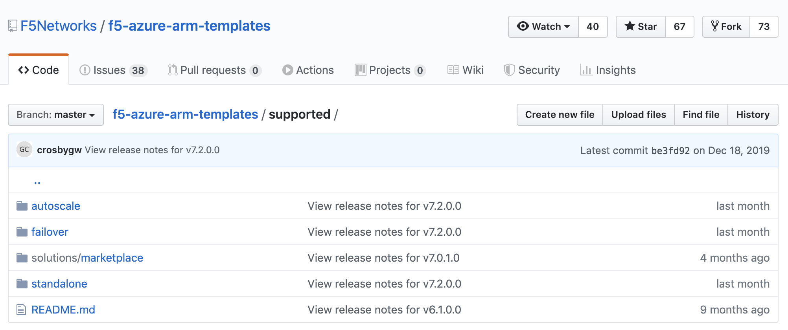
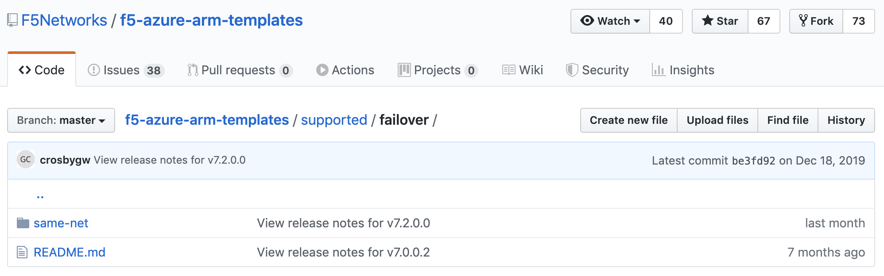
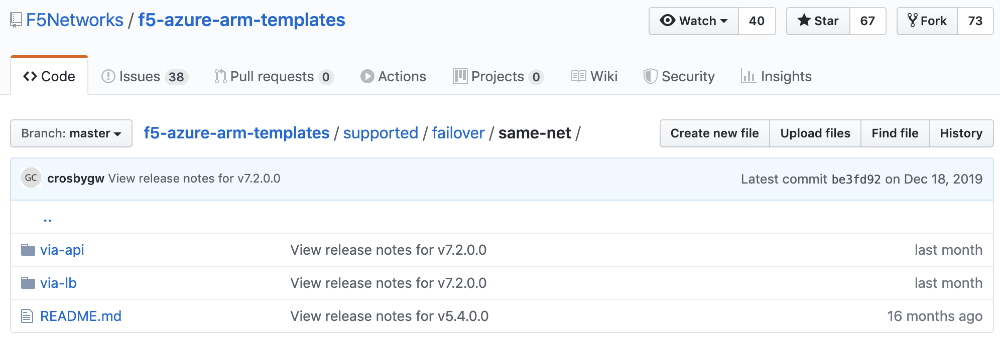
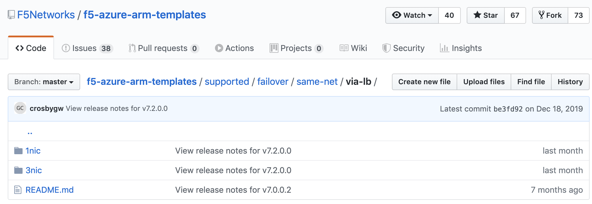
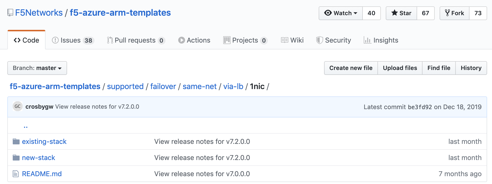
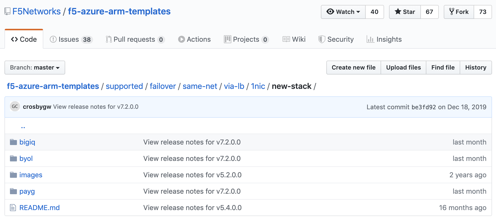
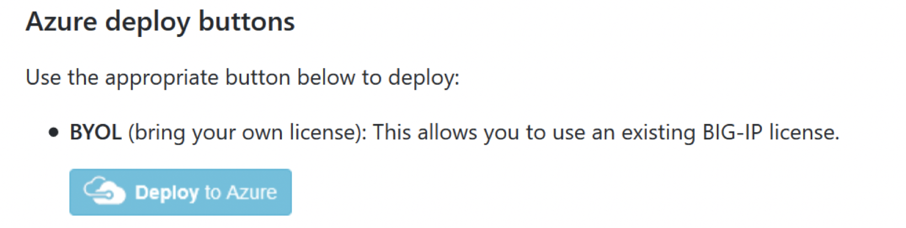

F5 NetworksのGitHubリポジトリの概要
================================================

Githubは、テンプレートと関連リソースが存在するソース管理システムです。

GitHubへARMテンプレートがアップロードされておりますので
そちらを選択してデプロイを進めていく形となります。

<https://github.com/F5Networks/f5-azure-arm-templates>

.. NOTE::
   **supported**ディレクトリがF5 supportedのテンプレートとなります。

|class-1-1|

Template Typesの選択
----------------

|class-1-2|

シングル構成であればstandalone、冗長構成であればfailoverを選択します。
autoscaleは自動的にスケールアウトを行いたい場合に選択します。
.. NOTE::
   autoscaleは、LTM/WAFのみ対応

Network Typeの選択
----------------

|class-1-3|

failoverを選択した場合は、各インスタンスを構築する場所を設定します。
同じAvailability Zone内で全てのインスタンスを構築する設定として
same-netを選択します。

.. NOTE::
   Availability Zoneを跨いだ冗長化の場合、Deploy Optionでゾーンを指定します

Traffic Distribution Typeの選択
----------------

|class-1-4|

failoverを選択した場合は、続いて冗長化の方式を選択します。
- via-api: Active/Standby構成で、障害発生時にAPIを用いて、BIG-IPの実IPを書き換える方式です。
- via-lb: Azure Load Balancerを用いて、Active/Standby構成あるいはActive/Active構成でトラフィックのバランシングを行う方式です。

Number of Network Interfacesの選択
----------------

|class-1-5|

standaloneを選択した場合は、1nic/2nic/3nic/n-nicの中から選択します。
- failoverでvia-apiを選択した場合はn-nicのみ選択可能です。
- failoverでvia-lbを選択した場合は1nic/3nicのどちらかを選択します。

Stack Typeの選択
----------------

|class-1-6|

新規でネットワーク設定を割り振る場合はnew-stackを選択します。
既に存在しているクラウドネットワークへデプロイする場合(既存のIPアドレスを手動で割り当てる場合)はexisting-stackを選択します。

Licensing Optionsの選択
----------------

|class-1-7|

サブスクリプションライセンスをご購入済みの場合はBYOL、ご利用に応じてライセンス使用料を支払われる場合はPAYGを選択します。

Deploy to Azureの選択
----------------

|class-1-8|

Deploy to Azureを選択すると、選択されたARMテンプレートを元にAzureへ画面が遷移します。

Deploy Optionの設定
----------------

Azure上でオプションパラメータの設定を行います。
必要に応じて、下記のパラメータを設定した上でPurchaseを選択して下さい。

- Resource Group
- DNS Label
- Instant Type(2vCPU 4G memory以上、1vCPU毎に2G memoryを追加BETTERは4vCPU、BESTは8vCPUが推奨)
- Image Name
- BYOLの場合はLTM/ALLのどちらかより選択
- PAYGの場合はGOOD/BETTER/BESTと25Mbps/200Mbps/1Gbpsより選択

.. |class-1-1| image:: images/class-1-1.png

.. toctree::
   :titlesonly:
   :maxdepth: 2
   :caption: Contents:
   :glob:

   intro
   module*/module*