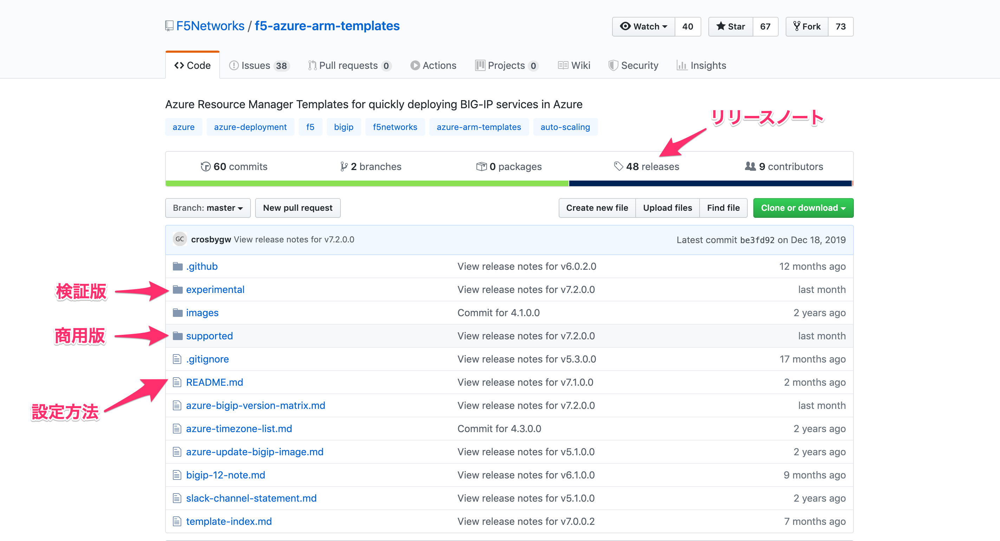

F5 NetworksのGitHubリポジトリの概要
================================================

Githubは、テンプレートと関連リソースが存在するソース管理システムです。

リポジトリにアクセスするために、以下のリンクをクリックしてください。
<https://github.com/F5Networks/f5-azure-arm-templates>

商用版のテンプレートは、**suppported**というフォルダ配下にあります。

|class-1-1|

例
----------------
新規環境に、スタンドアローン構成の1-NIC BIG-IP VEのPAYGインスタンスをデプロイするためのARMテンプレートは下記となります。
<https://github.com/F5Networks/f5-azure-arm-templates/tree/master/supported/standalone/1nic/new-stack/payg>

.. toctree::
   :titlesonly:
   :maxdepth: 2
   :caption: Contents:
   :glob:

   intro
   module*/module*